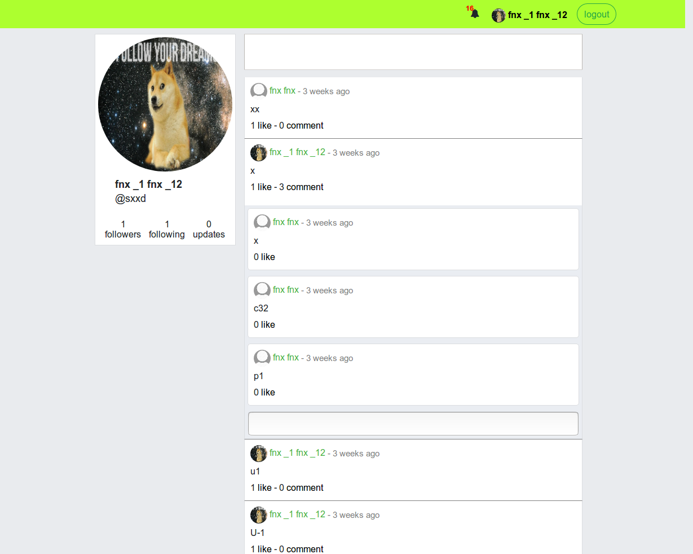

# Twoter SPA build with Angular5

## Description

Mini social network project combining features from Facebook and Twitter (post updates and comments, like updates and comments, register, login, follow other users, receive notification in realtime when your comment/update is liked, when someone you followed has posted an update).

## Features

- Auth: sign up, login, logout
- Update profile info, profile picture, etc.
- Follow other users
- Post updates. Updates may contain tags.
- Search updates by tags
- Comment updates
- Like posts and updates
- Receive realtime notifications for someone commenting on your updates, liking your updates or comments, someone you follow posts something. 

## Purpose

This project main purpose is for skill sharpenning
